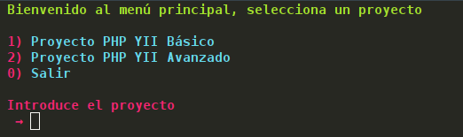
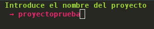
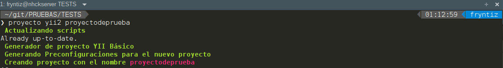
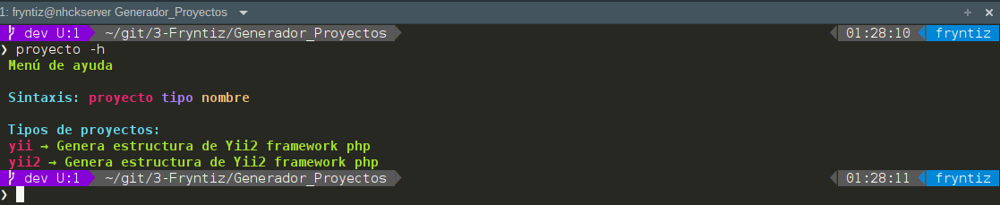

# Generador_Proyectos

Genera la estructura entre varios proyectos de los más recurridos en mi trabajo

El objetivo principal de este repositorio es crear de una forma sencilla un proyecto entre los cuales dejo planteado, mediante un menú de selección.

Se creará un comando solo para el usuario que podrá llamarse desde cualquier parte del sistema escribiendo "**proyecto**" dentro del directorio donde se desea crear. Una vez ejecutado el comando preguntará el tipo de proyecto a generar y creará su estructura.

Tras crear la estructura nos preguntará si inicializar el repositorio y después si crear un repositorio en github asociado al mismo.



## Requisitos

Para que funcione la subida a repositorio en github debes tener **hub** bien
configurado en el sistema. Más información en https://github.com/github/hub

Es fundamental tener instalado **git** en el sistema. En debian:

```bash
    sudo apt install git
```

El script está orientado a distribuciones GNU/Linux y solo se ha probado
en Debian GNU/Linux stable por lo que no se garantiza el funcionamiento en
otros sistemas o incluso otras ramas de la misma distribución.

Más información sobre Debian: https://www.debian.org/

Para aplicaciones o frameworks php es necesario tener instalado **composer**.
Más sobre comoser: https://getcomposer.org/

Para aplicaciones o frameworks python es necesario tener instalado **pip** y/o
**pip3** para python3. Más información: https://es.wikipedia.org/wiki/Pip_(administrador_de_paquetes)

## Instalación

El primer paso es obtener el repositorio:

```bash
    git clone https://github.com/fryntiz/Generador_Proyectos.git
```

Para instalar este script solo hay que ejecutar **instalar.sh**:

```bash
    cd Generador_Proyectos
    ./instalar.sh
```

## Funcionamiento

Hay dos formas de usar este script:

### Modo interactivo

Pide paso por paso cada acción a realizar a través de un menú interactivo dónde
se introduce el número de la opción a realizar.

Para entrar de este modo solo es necesario escribir en un terminal:

```bash
    proyecto
```

El resultado o acciones serán ejecutadas en el mismo directorio donde nos
encontremos actualmente por lo que primero deberemos entrar en el directorio de
trabajo.



### Modo directo

El modo directo nos permite introducir como primer parámetro el comando puede
recibir el tipo de proyecto y como segundo parámetro el nombre del proyecto
resultando la siguiente sintaxis:

```bash
    proyecto tipo nombre
```

Quedando un ejemplo como el siguiente:

```bash
    proyecto yii2 web_curriculum
```



## Proyectos implementados

Las plantillas de proyectos implementadas hasta el momento son:

|   Lenguaje   |  framework   |   Plantilla  |    Custom    |
| :----------: | :----------: | :----------: | :----------: |
|     php      |     yii2     |    Básica    |      Si      |

-   Lenguaje  → Indica para que lenguaje de programación está orientado.
-   Framework → Indica el framework del cual crea el esqueleto (si lo hubiera).
-   Plantilla → Indica sobre que plantilla oficial está basado el esqueleto.
-   Custom    → Indica si está personalizada o es igual que la oficial.

## Menú de ayuda

El comando incluye una ayuda donde se puede ver en cualquier momento y desde
cualquier parte la sintaxis, el orden y los proyectos que se pueden generar.

Podemos utilizar cualquiera de las dos formas siguientes para invocar la ayuda:

```bash
    proyecto -h
```

```bash
    proyecto --help
```

Resultando una ayuda como en la imagen a continuación:



## A tener en cuenta

Prácticamente todos los proyectos tendrán dependencias que se resuelven automáticamente si tenemos bien instalado las tecnologías necesarias.

Se parte de haber preparado el script con una de las siguientes
**herramientas** o conjunto de **scripts** propios:

- https://github.com/fryntiz/Fedora_Developer_Init
- https://github.com/fryntiz/Debian_Developer_Init

La Guía de **estilos** usada para la sintaxis en **bash** es la siguiente:

- https://github.com/fryntiz/Bash_Style_Guide

Se deberá tener configurado gestores de paquetes para cada **proyecto** y para **git**:
- Para que funcione correctamente se deberá tener instalado servidores y tecnologías necesarias para cada ámbito, por ejemplo para un proyecto **php** deberá existir **composer**, para python **pip**
- Para inicializar repositorio deberá estar instalado **GIT**.
- Para poder crear repositorio en **GitHub** correctamente deberá estar **git** configurado en el sistema.
